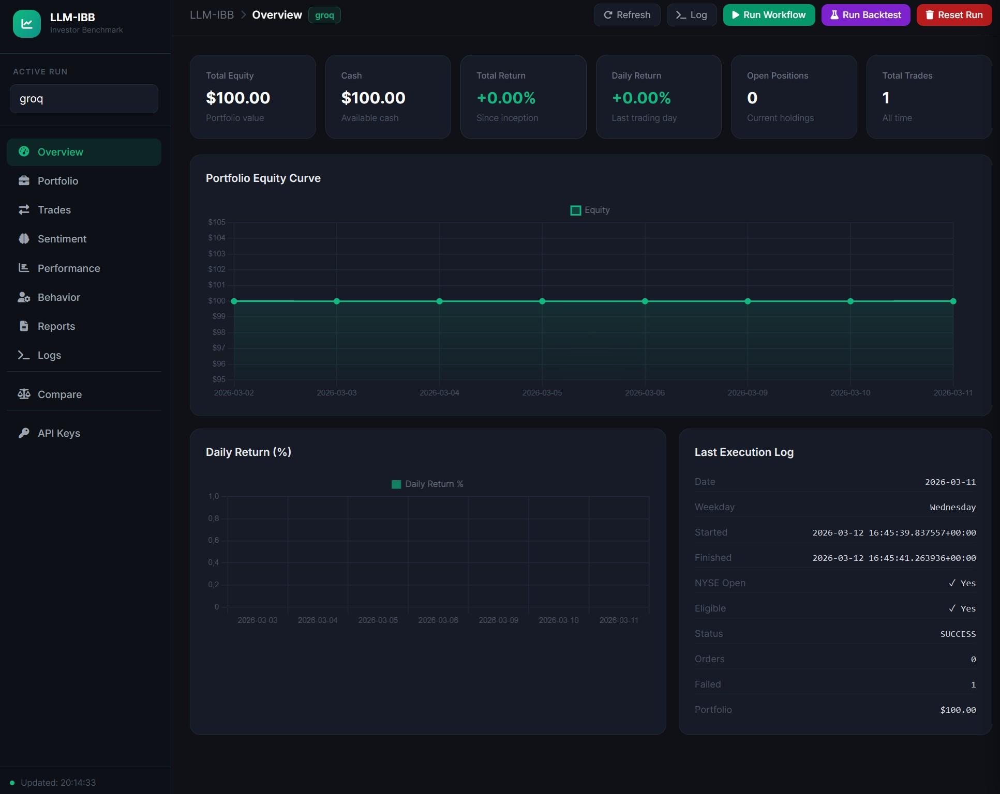

# LLM Investor Behavior Benchmark (LIBB) — Fork

> **This repository is a fork of**
> [LuckyOne7777/LLM-Investor-Behavior-Benchmark](https://github.com/LuckyOne7777/LLM-Investor-Behavior-Benchmark).
> The original project serves as the foundation; all changes and additions
> compared to upstream are documented in the [Changes from the Original](#changes) section.

---

## What is LIBB?

LIBB is an open-source research library that automatically manages portfolio state
and calculates core metrics — while giving the user full control over the execution logic.

## Why does LIBB exist?

The project originally started as a generic benchmark for LLM-driven trading with
US equities. When analyzing existing LLM-trading projects it became clear that
rigorous sentiment, behavioral, and performance metrics are almost universally missing —
most projects show nothing more than an equity curve.

This raises a fundamental question: ***"Why isn't LLM trading held to the same
analytical standards as the rest of the financial world?"***

LIBB aims to provide a shared foundation for this work and to establish a community
standard for this research area in the long run.

---

## Features (Original)

- **Persistent portfolio state** – all data is explicitly written to disk
  (reproducibility, post-hoc analysis)
- **Behavioral, performance, and sentiment metrics** – HHI concentration,
  loss aversion, turnover, Sharpe, Sortino, max drawdown, CAPM, Loughran-McDonald lexicon
- **Atomic portfolio processing with rollback** – if a run fails, the disk state
  is rolled back to the startup snapshot
- **Reproducible run structure** – uniform directory layout per experiment
- **Flexible execution workflows** – strategy, model, and data sources remain
  entirely in the user's hands

---

<a name="changes"></a>
## Changes from the Original

### 1 · Groq Free-Tier LLM Support
**File:** `user_side/prompt_orchestration/prompt_models.py`

In addition to DeepSeek and GPT-4.1, a full **Groq adapter** with intelligent
rate-limit handling was added:

| Model | Daily Quota | Characteristics |
|---|---|---|
| `llama-3.3-70b-versatile` | 100,000 tokens/day | Best reasoning |
| `meta-llama/llama-4-scout-17b-16e-instruct` | 500,000 tokens/day | Llama 4, 5× quota |
| `llama-3.1-8b-instant` | 500,000 tokens/day | Fast & lightweight |

**Fallback strategy:**
- Rate-limit ≤ 90 s → automatic wait + retry on the same model
- Rate-limit > 90 s (daily quota exhausted) → immediate switch to the next model
- Decommissioned model → immediate skip
- Transient errors → exponential backoff (2 s, 4 s), then next model
- All models exhausted → `RuntimeError` with a clear message

Groq is **free to use** (free API key at https://console.groq.com).

---

### 2 · Flask Web Dashboard
**File:** `dashboard.py`



Full web dashboard with:

- **Portfolio monitoring** – live equity, cash, positions, trade log
- **Multi-run comparison** – equity curves of multiple runs side by side
- **Metrics view** – behavior, performance, sentiment per run
- **Report browser** – daily reports and deep-research texts directly in the browser
- **Backtest control** – start, stop (cancel), live log stream
- **Workflow trigger** – manual start of the trading workflow via button
- **API key management** – encrypted key store, manageable directly in the UI
  (no manual editing of `.env` files required)
- **Ticker name resolution** – static lookup table + yfinance fallback

Start:
```bash
python dashboard.py   # http://0.0.0.0:5000
```

---

### 3 · Backtesting Engine
**File:** `user_side/backtesting_workflow.py`

New function `smallcap_backtest()` for historical simulations:

```python
from user_side.backtesting_workflow import smallcap_backtest

smallcap_backtest(
    run_dir="user_side/runs/run_v1/groq",
    start="2025-01-01",
    end="2025-03-01",
    reset_on_start=True,   # wipe run before starting
)
```

Features:
- Automatically skips already-processed dates (skip-guard)
- **Report caching** – if a report file already exists for a date, the LLM call
  is skipped and the cache is parsed directly
- **Cancel support** via `threading.Event` – can be aborted at any time (including from the dashboard)
- Final metrics (performance + behavior) are generated automatically
- Configurable sleep times between days / LLM calls (rate-limit protection)

---

### 4 · Encrypted API Key Store
**File:** `libb/other/key_store.py`

API keys are stored **Fernet-symmetrically encrypted** in `secrets.json`;
the encryption key lives in `secrets.key`. Both files must never be committed.

```python
from libb.other.key_store import load_into_environ
load_into_environ()   # call once at app startup
```

Supported keys (manageable via the dashboard):
- `GROQ_API_KEY`
- `OPENAI_API_KEY`
- `DEEPSEEK_API_KEY`

---

### 5 · Combined App Server with Scheduler
**File:** `app.py`

Starts the Flask dashboard **and** a background scheduler in a single process:

```bash
python app.py   # dashboard + scheduler
```

The scheduler runs the trading workflow Mon–Fri at **21:45 UTC** (≈ 16:45 ET,
after NYSE close). Ideal for running on an always-on server (e.g. Armbian/Raspberry Pi).

---

### 6 · Small-Cap Focus (Europe)
**Files:** `user_side/prompts/`, `user_side/prompt_orchestration/get_prompt_data.py`

Prompts and candidate selection are tailored to **European small-caps ≤ 10 EUR**
(XETRA Frankfurt, Helsinki, London, Amsterdam, Paris, Madrid, Milan).

Default configuration in the backtest:
- Starting capital: **100 EUR**
- Trading fee: **1 EUR / order** (flat)
- Market calendar: **XETR** (Deutsche Börse)
- Max positions: **5** simultaneously

---

### 7 · Market Calendar & Commission Parameters
**File:** `libb/model.py`

`LIBBmodel` now accepts two new parameters:

```python
libb = LIBBmodel(
    "user_side/runs/run_v1/groq",
    starting_cash=100.0,
    commission=1.0,          # EUR flat per order
    market_calendar="XETR",  # alternatively "NYSE"
)
```

Configuration is persisted once in `config.json` inside the run directory
and automatically inherited on all subsequent starts.

---

### 8 · Extended `reset_run()` with `auto_ensure`

```python
libb.reset_run(cli_check=False, auto_ensure=True)
```

`auto_ensure=True` automatically performs after deletion:
- Recreate filesystem (`ensure_file_system`)
- Re-hydrate disk state into memory (`_hydrate_from_disk`)
- Reset runtime state (counters, timestamps, snapshots)

The result is a fresh instance without restarting the Python process.

---

## Example Workflow (Extended)

```python
from libb import LIBBmodel
from libb.other.parse import parse_json
from user_side.prompt_orchestration.prompt_models import prompt_daily_report

MODELS = ["groq", "deepseek", "gpt-4.1"]

def daily_flow():
    for model in MODELS:
        libb = LIBBmodel(
            f"user_side/runs/run_v1/{model}",
            commission=1.0,
            market_calendar="XETR",
        )
        libb.process_portfolio()

        daily_report = prompt_daily_report(libb)

        libb.save_daily_update(daily_report)
        libb.analyze_sentiment(daily_report, report_type="daily")

        orders_json = parse_json(daily_report, "ORDERS_JSON")
        libb.save_orders(orders_json)
```

---

## Generated Directory Layout

```text
<output_dir>/
├── config.json               # run configuration (written once)
├── metrics/
│   ├── behavior.json
│   ├── performance.json
│   └── sentiment.json
├── portfolio/
│   ├── cash.json
│   ├── pending_trades.json
│   ├── portfolio.csv
│   ├── portfolio_history.csv
│   ├── position_history.csv
│   └── trade_log.csv
├── logging/
└── research/
    ├── daily_reports/
    └── deep_research/
```

---

## Installation

### Recommended: Virtual Environment

```bash
git clone https://github.com/<your-fork>/LLM-Investor-Behavior-Benchmark.git
cd LLM-Investor-Behavior-Benchmark
python -m venv .venv

# Windows (PowerShell)
.venv\Scripts\activate

# macOS / Linux
source .venv/bin/activate

pip install --upgrade pip
pip install -r requirements.txt
pip install -e .
```

### Verify dependencies
```bash
python -c "import libb; print(libb.__file__)"
```

### Set API Keys

**Option A – Environment variables (classic)**
```bash
# Windows PowerShell
setx GROQ_API_KEY "your_key"
setx OPENAI_API_KEY "your_key"
setx DEEPSEEK_API_KEY "your_key"
```

**Option B – Encrypted key store (recommended)**  
Start the dashboard and enter keys under **Settings → API Keys** — keys are stored
Fernet-encrypted locally.

### Start

```bash
# Dashboard only
python dashboard.py

# Dashboard + automatic scheduler (Mon–Fri 21:45 UTC)
python app.py

# Workflow only (one-shot)
python -m user_side.workflow

# Backtest
python -c "
from user_side.backtesting_workflow import smallcap_backtest
smallcap_backtest('user_side/runs/run_v1/groq', start='2025-01-01')
"
```

---

## Research Directions

Current areas of interest:

- Completing remaining behavioral metrics (momentum factor, volatility tolerance, risk aversion)
- Deeper integration of performance analytics into the core workflow
- Expanding sentiment analysis to multiple data sources
- Improved tooling for comparing runs and strategies
- Config system to centralize experiment parameters
- General design improvements for efficiency and code quality

Current roadmap: [short-term-roadmap.md](docs/short-term-roadmap.md)

---

## Documentation

New here? Start here → **[Documentation Guide](docs/README.md)**

---

## License

This project is licensed under the same license as the original project.
See [LICENSE](LICENSE).
